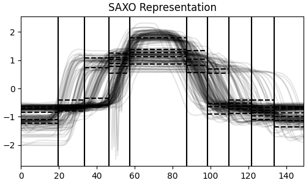
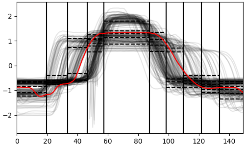

[](https://github.com/KhiopsLab/saxo/actions/workflows/test.yml)
[](https://img.shields.io/badge/python-3.12-blue)

# SAXO

> **S**ymbolic **A**ggregate appro**X**imation **O**ptimized with MODL

SAXO is a data-driven symbolic representation for time series. Unlike standard SAX which relies on equal-sized intervals and Gaussian distributions, SAXO optimizes both time and value discretization using a non-parametric Bayesian approach (MODL).

## Install

You can install from the main branch of GitHub:

```console
pip install git+https://github.com/KhiopsLab/saxo.git@main
```

**Requirements:**

- khiops

## Usage

Compute the SAXO representation of a datasets of time-series:
```python
from aeon.datasets import load_gunpoint
from saxo.sklearn import SAXO

X, y = load_gunpoint()
saxo = SAXO(max_intervals=10, max_symbols=5).fit(X)
X_transformed = saxo.transform(X)
```

```
>>> X_transformed
array([['b', 'd', 'b', ..., 'b', 'a', 'b'],
       ['b', 'c', 'a', ..., 'b', 'a', 'b'],
       ['a', 'b', 'b', ..., 'a', 'd', 'b'],
       ...,
       ['a', 'b', 'b', ..., 'b', 'a', 'c'],
       ['c', 'a', 'd', ..., 'd', 'b', 'e'],
       ['c', 'a', 'e', ..., 'd', 'c', 'd']], shape=(200, 10), dtype=object)
```

Plot SAXO time and value discretization:
```python
from matplotlib import pyplot as plt
from saxo.viz import plot_saxo

fig, ax = plt.subplots(figsize=(5, 3), layout="constrained")
plot_saxo(saxo, [ax], X=X)
ax.set_xlim((0, X.shape[-1] - 1))
plt.show()
```


Can then be used with any scikit-learn estimator:
```python
from sklearn.manifold import TSNE
from sklearn.preprocessing import OneHotEncoder, LabelEncoder
from sklearn.decomposition import PCA
from sklearn.pipeline import make_pipeline
import matplotlib.pyplot as plt

X_projected = make_pipeline(OneHotEncoder(sparse_output=False), PCA(n_components=10), TSNE()).fit_transform(X_transformed)
y = LabelEncoder().fit_transform(y)
plt.scatter(X_projected[:, 0], X_projected[:, 1], c=y)
plt.show()
```

```python
from sklearn.linear_model import LogisticRegression
from sklearn.preprocessing import OneHotEncoder, LabelEncoder
from sklearn.pipeline import make_pipeline

clf = make_pipeline(OneHotEncoder(), LogisticRegression()).fit(X_transformed)
clf.score(X_transformed, y)
```

```python
from sklearn.cluster import KMeans
from sklearn.preprocessing import OneHotEncoder

y_pred = make_pipeline(OneHotEncoder(), KMeans(3)).fit_predict(X_transformed)
colors = ["red", "blue", "green"]
for i in range(3):
    plt.plot(X[y_pred == i].squeeze().transpose(), color=colors[i], alpha=0.01)
plt.show()
```

You can also do anomaly detection with SAXO (by computing the distance between the time series and the typical time series associated with its representation):

```python
y_pred_saxo = saxo.score_samples(X)
ano_saxo = y_pred_saxo.sum(axis=1).argmin()

fig, ax = plt.subplots(figsize=(5, 3), layout="constrained")
plot_saxo(saxo, [ax], X=X)
ax.plot(X[ano_saxo].T, color="red")
ax.set_xlim((0, X.shape[-1] - 1))
plt.show()
```


## References

**SAXO representation**

> Alexis Bondu, Marc Boullé and Benoît Grossin. "SAXO: An optimized data-driven symbolic representation of time series". *International Joint Conference on Neural Networks (IJCNN)*. IEEE, 2013.

> Alexis Bondu, Marc Boullé, and Antoine Cornuéjols. "Symbolic representation of time series: A hierarchical coclustering formalization." *Advanced Analytics and Learning on Temporal Data (AALTD)*. Springer, 2015.

**Anomaly detection with coclustering**

> Guigourès, Romain. "Utilisation des modèles de co-clustering pour l'analyse exploratoire des données." Diss. Université Panthéon-Sorbonne-Paris I, 2013.

## Development

Formatting and linting is done with ruff as a [pre-commit](https://pre-commit.com/):
- install: ```pre-commit install```, 
- format and lint: ```pre-commit run --all-files``` (automatically done before a commit).

Run tests with [uv](https://docs.astral.sh/uv/getting-started/installation/#standalone-installer): ```uv run pytest```.